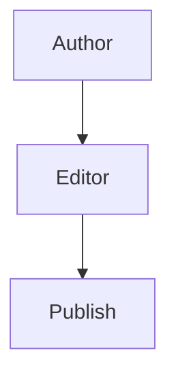

# coding-gurukul-blog-assignment

A production-style blog CMS assignment built with Next.js 14 App Router, TypeScript, Tailwind CSS, and MDX.

## Project Overview

This project is a blog management system built with Next.js App Router, TypeScript, Tailwind CSS, and MDX.
It supports:

- Editorial-style homepage with search, tag filters, and pagination
- SEO-friendly blog detail pages with SSG and metadata
- Admin dashboard for create, edit, publish toggle, and delete
- Rich MDX editing with autosave and preview
- Content image upload with URL insertion from the editor
- Embedded rich content (YouTube, link cards) and Mermaid diagrams
- Dark mode and responsive layouts

## Tech Stack

- Next.js 14 (App Router): server components, metadata, route handlers, SSG
- TypeScript: static type safety
- Tailwind CSS: fast and consistent UI styling
- next-mdx-remote/rsc: server-side MDX rendering for SEO and performance
- @uiw/react-md-editor: rich markdown editing experience
- reading-time: reading-time calculation for cards/detail pages
- rehype-highlight + rehype-slug + rehype-autolink-headings: syntax highlighting and heading anchors
- next-themes: dark mode support
- sonner: toast notifications in admin flows
- Local JSON store: lightweight data layer for demo/dev

## Setup

1. Install dependencies:

```bash
npm install
```

2. Run development server:

```bash
npm run dev
```

3. Open:

```text
http://localhost:3000
```

## Repository

- GitHub: https://github.com/nitishkumarkushwaha21/coding-gurukul-blog-assignment

## Folder Structure

```text
src/
  app/
    page.tsx
    loading.tsx
    not-found.tsx
    sitemap.ts
    robots.ts
    blog/[slug]/page.tsx
    admin/page.tsx
    admin/new/page.tsx
    admin/edit/[slug]/page.tsx
    api/blogs/...
  components/
    BlogCard.tsx
    BlogListingClient.tsx
    BlogDetail.tsx
    AdminBlogTable.tsx
    AdminEditor.tsx
    TableOfContents.tsx
    ThemeProvider.tsx
    ThemeToggle.tsx
    ui/...
  lib/
    blogs.ts
    mdx.tsx
    seo.ts
  data/
    blogs.json
  types/
    blog.ts
```

## Key Decisions

- File-based JSON store was chosen for simplicity and project scope. No external DB is required for demo/dev.
- next-mdx-remote/rsc is used for server-side MDX rendering so content is SEO-friendly and fast.
- Blog detail pages use generateStaticParams for SSG to improve performance and cacheability.
- @uiw/react-md-editor provides practical rich editing without introducing a full backend CMS.

## SEO and Performance Notes

- Dynamic sitemap and robots are generated from published content.
- Blog metadata includes Open Graph and Twitter cards.
- Article JSON-LD structured data is injected on detail pages.
- Above-the-fold images use priority where appropriate.
- Admin MD editor is dynamically imported to reduce initial bundle cost.

## Vercel Deployment Notes

- A minimal vercel.json already exists and works for Next.js.
- This project supports two storage modes:
  - Default fallback: file writes to src/data/blogs.json (local/dev friendly)
  - Optional production mode: Neon Postgres (persistent)
- On Vercel production, JSON writes are not persistent, so Neon mode is recommended.

## Database Setup (Optional, Recommended for Production)

1. Create a Neon Postgres database.
2. Run SQL from postgres-schema.sql on your Neon database.
3. Create environment file from .env.example and set:

```bash
DATABASE_URL=postgresql://...
CLOUDINARY_CLOUD_NAME=...
CLOUDINARY_API_KEY=...
CLOUDINARY_API_SECRET=...
NEXT_PUBLIC_SITE_URL=https://your-domain.com
```

4. Restart the app.

If `DATABASE_URL` is missing, the app automatically uses local JSON storage.

## Known Limitations

- Local JSON storage is best for local/dev demos only (unless Neon mode is enabled).
- No authentication or authorization is enforced for admin routes.
- Search is basic and does not include fuzzy ranking.
- Embedded cards are basic by design (no external oEmbed fetching yet).

## If More Time Was Available

- Add authentication and role-based admin access.
- Add DB migration/seed scripts and richer data validation around Neon writes.
- Add full-text search and category archives.
- Add integration tests for API + editor workflows.
- Add analytics and content performance dashboards.

## Live Demo

- Pending deployment. Add your live URL here once deployed.

## Rich Content Examples

Use these patterns in post content:

```md
<YouTube id="dQw4w9WgXcQ" title="Demo video" />

<EmbedCard
  href="https://nextjs.org/docs"
  label="Reference"
  description="Official Next.js documentation"
 />


```
